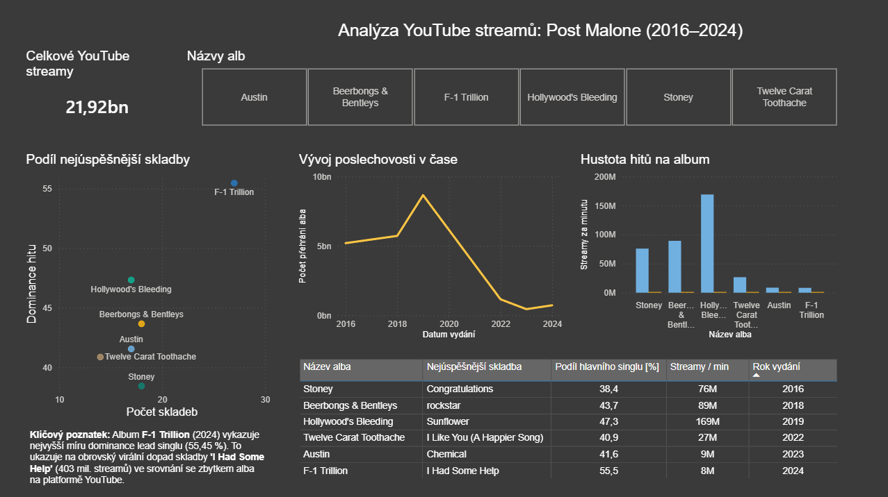

# Post Malone: Datová analýza diskografie (2016–2024)

## Přehled projektu
Tento projekt provádí hloubkovou analýzu výkonnosti kariéry Post Malona na YouTube Music, pokrývající 6 studiových alb a 163 skladeb. Cílem bylo kvantifikovat vývoj jeho streamovací síly a analyzovat, nakolik úspěch alba závisí na jeho „hlavním singlu“ ve srovnání s celkovou stopáží.

---

### Náhled Dashboardu

---

## Použité nástroje a technologie
* **Databáze:** MySQL
* **Techniky:** Pokročilé SQL (Common Table Expressions – CTE, window functions `RANK() OVER()`, `SUM() OVER()`, časové transformace)
* **Vizualizace dat:** Power BI (Interaktivita, vlastní KPI, kalkulované metriky, Data Storytelling)

## Analýzovaný problém
V éře streamování mohou být celkové počty přehrání zavádějící kvůli rozdílným délkám alb a vlivu virálních singlů. Cílem bylo normalizovat výkon pomocí dvou klíčových metrik:
1. **Hustota hitů:** Průměrný počet streamů na jednu minutu stopáže alba.
2. **Dominance hlavního singlu:** Procentuální podíl nejúspěšnější skladby na celkové poslechovosti alba.

Tento přístup umožňuje identifikovat, které projekty jsou skutečně ucelené a které spoléhají na jeden masivní hit.

## Klíčová zjištění
Transformací surových dat z YouTube do pokročilých metrik byla odhalena zásadní zjištění:
* **Vrchol streamování:** Album **Hollywood's Bleeding (2019)** zůstává nejsilnějším projektem diskografie s nejvyšší „Hustotou hitů“ – **169 milionů streamů na minutu**.
* **Dominance singlu:** Existuje rostoucí trend „závislosti na hitech“. U nejnovějšího alba **F-1 Trillion (2024)** tvoří jediná skladba neuvěřitelných **55,45 %** celkové poslechovosti alba.
* **Kumulativní dosah:** Napříč všemi analyzovanými projekty dosáhl celkový objem streamování **21,92 miliardy** přehrání.

## SQL Logika
Pro zajištění přesné analýzy jsem použil modulární CTE k agregaci počtů přehrání, hodnocení skladeb v rámci každého alba a výpočtu procentuálních podílů na celkovém objemu alba. Tato logika umožňuje čisté propojení metrik na úrovni alb s výkonem hlavních singlů.

---

## 📂 Soubory ke stažení
* 📝 **SQL Skript:** [post_malone_analysis.sql](./post_malone_analysis.sql) - Plný, komentovaný kód pro transformaci dat.
* 📊 **Zdrojová data:** [post_malone_data.csv](./cesta/k/vasemu/souboru.csv) - Kompletní dataset s daty o přehrání a stopáži.
